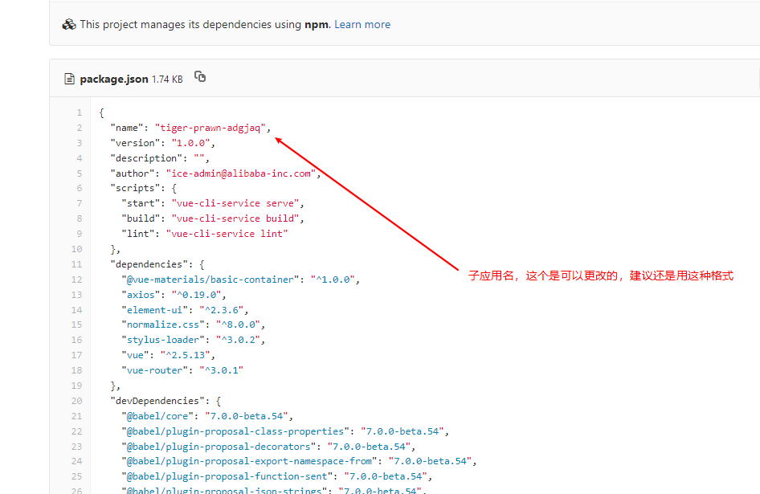
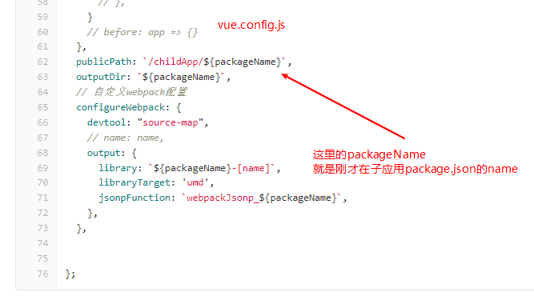
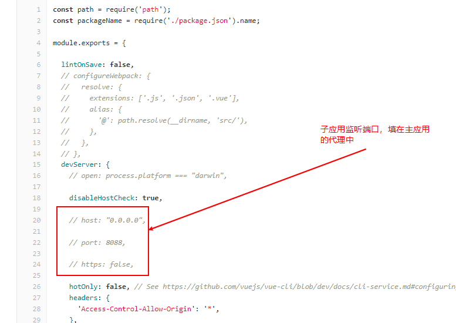
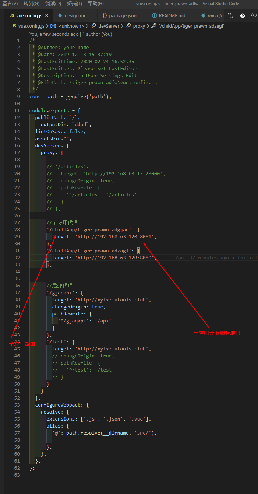
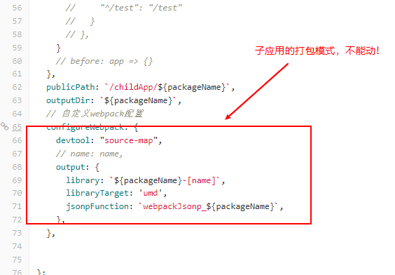

# 钉钉桌面端主应用

## 微应用配置部分在 src/qiankun.config.js
具体使用[查看qiankun文档](https://github.com/umijs/qiankun)

子应用开发需要vue-router history模式，
子应用的打包路经需要为/childApp/****，详见参考vue.config.js的dev.proxy

关于微应用的详细解释在项目内的另外两个md。

### 主应用和子应用开发时的联动方式

> 需要配置的地方比较多，最好复制之前的pc端子应用修改下名字就好了

## 钉钉鉴权部分在main.js
没有具体开发，后续需要钉钉鉴权，可以参考[另外一个项目 ddmb](http://gitlab.bearhunting.cn/frontend/ddmb.git)的钉钉鉴权部分

## 接口代码自动化生成

没有。可以仿照之前项目加入

## 自动化发布

测试环境 192.168.63.200 /home/lxz/sl/deploy/ddad
正式环境 192.168.199.164 /export/apps/nginx/html/ddad

CI/CD 已经搭建好。
merge master发布测试环境，merge deploy发布正式环境。
测试环境没有代理服务，只能做前端测试使用。